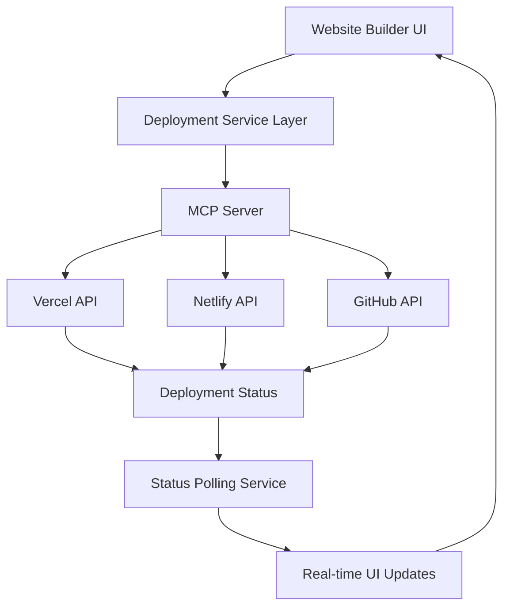
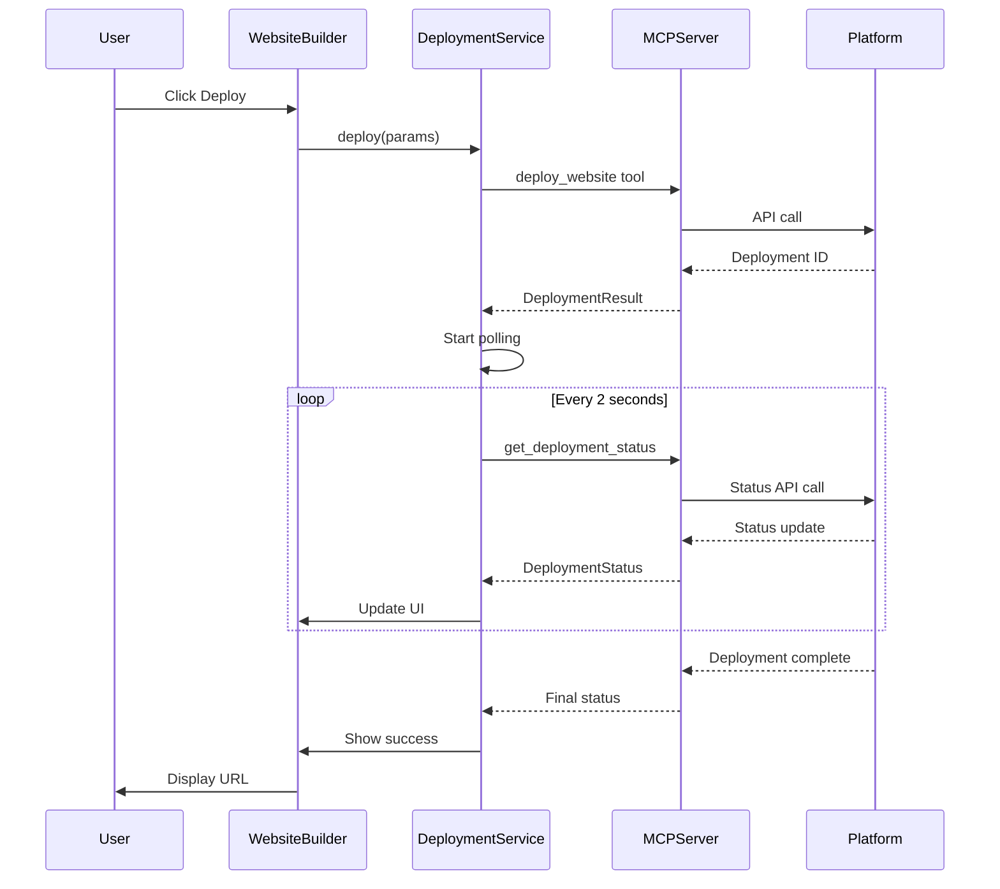
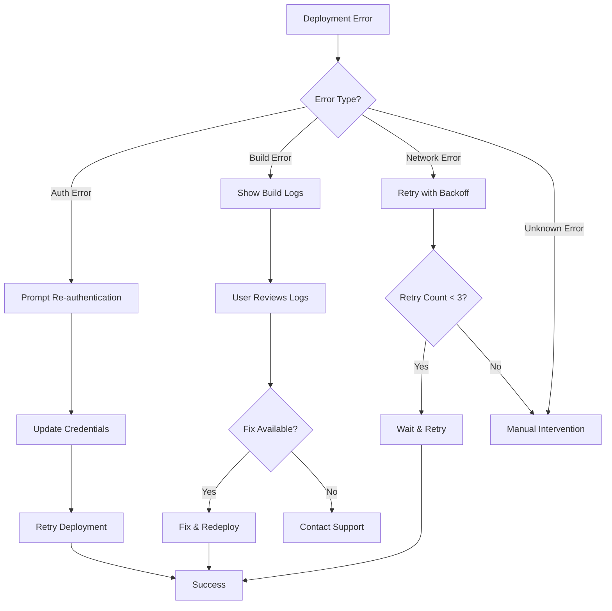
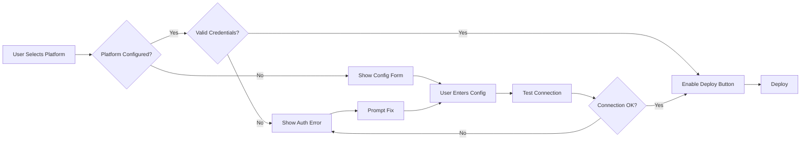

# MCP Server Integration Plan: Multi-Platform Website Deployment

## Executive Summary

This plan outlines the integration of Model Context Protocol (MCP) servers to enable direct deployment of AI-generated websites from the Website Builder to three major hosting platforms: **Vercel**, **Netlify**, and **GitHub Pages**. The system will provide real-time deployment status tracking, comprehensive error handling, and rollback capabilities.

---

## 1. Architecture Overview



### Key Components

1. **MCP Server** - Custom server handling deployment operations for all platforms
2. **Deployment Service Layer** - Unified API abstracting platform-specific logic
3. **Status Tracking System** - Real-time monitoring of deployment progress
4. **UI Components** - Enhanced interface for deployment management
5. **Error Handling & Rollback** - Comprehensive failure recovery mechanisms

---

## 2. MCP Server Implementation

### 2.1 Server Structure

**File**: `mcp-servers/deployment-server/index.ts`

```typescript
// Core MCP server for multi-platform deployments
interface DeploymentServer {
  // Platform-specific deployment methods
  deployToVercel(config: VercelConfig): Promise<DeploymentResult>
  deployToNetlify(config: NetlifyConfig): Promise<DeploymentResult>
  deployToGitHub(config: GitHubConfig): Promise<DeploymentResult>
  
  // Status tracking
  getDeploymentStatus(deploymentId: string): Promise<DeploymentStatus>
  
  // Rollback functionality
  rollbackDeployment(deploymentId: string): Promise<RollbackResult>
}
```

### 2.2 Platform-Specific Handlers

#### Vercel Integration
- **API**: Vercel REST API v2
- **Authentication**: Bearer token (API key)
- **Deployment Method**: File upload via API
- **Status Polling**: `/v13/deployments/{id}` endpoint
- **Features**: Automatic HTTPS, instant rollbacks, preview URLs

#### Netlify Integration
- **API**: Netlify API v1
- **Authentication**: Personal access token
- **Deployment Method**: Direct file upload or Git integration
- **Status Polling**: `/api/v1/deploys/{id}` endpoint
- **Features**: Form handling, serverless functions, split testing

#### GitHub Pages Integration
- **API**: GitHub REST API v3
- **Authentication**: Personal access token or GitHub App
- **Deployment Method**: Push to `gh-pages` branch
- **Status Polling**: GitHub Actions workflow status
- **Features**: Free hosting, custom domains, Jekyll support

### 2.3 MCP Server Tools

The server will expose these tools via MCP protocol:

```typescript
// Tool definitions for MCP
const tools = [
  {
    name: "deploy_website",
    description: "Deploy website to selected platform",
    parameters: {
      platform: "vercel | netlify | github",
      htmlContent: "string",
      projectName: "string",
      config: "PlatformConfig"
    }
  },
  {
    name: "get_deployment_status",
    description: "Get real-time deployment status",
    parameters: {
      deploymentId: "string",
      platform: "string"
    }
  },
  {
    name: "rollback_deployment",
    description: "Rollback to previous deployment",
    parameters: {
      deploymentId: "string",
      platform: "string"
    }
  },
  {
    name: "list_deployments",
    description: "List deployment history",
    parameters: {
      projectId: "string",
      limit: "number"
    }
  }
]
```

---

## 3. Deployment Service Layer

### 3.1 Service Architecture

**File**: `src/services/deploymentService.ts`

```typescript
interface DeploymentService {
  // Unified deployment interface
  deploy(params: DeploymentParams): Promise<DeploymentResult>
  
  // Status monitoring
  watchDeployment(deploymentId: string): Observable<DeploymentStatus>
  
  // History management
  getDeploymentHistory(projectId: string): Promise<Deployment[]>
  
  // Rollback
  rollback(deploymentId: string): Promise<void>
}

interface DeploymentParams {
  platform: 'vercel' | 'netlify' | 'github'
  htmlContent: string
  projectName: string
  config: PlatformConfig
}

interface DeploymentResult {
  deploymentId: string
  url: string
  status: 'pending' | 'building' | 'ready' | 'error'
  platform: string
  timestamp: string
}

interface DeploymentStatus {
  id: string
  state: 'queued' | 'building' | 'ready' | 'error' | 'canceled'
  progress: number // 0-100
  logs: string[]
  url?: string
  error?: string
}
```

### 3.2 Platform Adapters

Each platform will have a dedicated adapter implementing common interface:

```typescript
interface PlatformAdapter {
  deploy(content: string, config: any): Promise<DeploymentResult>
  getStatus(deploymentId: string): Promise<DeploymentStatus>
  rollback(deploymentId: string): Promise<void>
  validateConfig(config: any): boolean
}

// Implementations
class VercelAdapter implements PlatformAdapter { }
class NetlifyAdapter implements PlatformAdapter { }
class GitHubPagesAdapter implements PlatformAdapter { }
```

---

## 4. Data Model Updates

### 4.1 Project Type Extensions

**File**: `src/types/index.ts`

```typescript
export interface Project {
  // ... existing fields
  
  // New deployment fields
  deploymentConfig?: DeploymentConfig
  deploymentHistory?: Deployment[]
  activeDeployment?: string // Current deployment ID
}

export interface DeploymentConfig {
  vercel?: {
    apiToken: string
    teamId?: string
    projectId?: string
  }
  netlify?: {
    apiToken: string
    siteId?: string
  }
  github?: {
    token: string
    repo: string
    branch: string // default: 'gh-pages'
  }
  preferredPlatform?: 'vercel' | 'netlify' | 'github'
}

export interface Deployment {
  id: string
  platform: 'vercel' | 'netlify' | 'github'
  status: 'pending' | 'building' | 'ready' | 'error' | 'canceled'
  url?: string
  previewUrl?: string
  createdAt: string
  completedAt?: string
  error?: string
  logs: DeploymentLog[]
  metadata: {
    projectName: string
    htmlSize: number
    buildTime?: number
  }
}

export interface DeploymentLog {
  timestamp: string
  level: 'info' | 'warn' | 'error'
  message: string
}
```

---

## 5. UI Components

### 5.1 Enhanced Deployments Page

**File**: `src/pages/modules/Deployments.tsx`

**New Features**:
- Platform selection tabs (Vercel, Netlify, GitHub Pages)
- Configuration forms for each platform
- API token management with secure storage
- Connection status indicators
- Test deployment button

**UI Layout**:
```
┌─────────────────────────────────────────┐
│ Deployments & Integrations              │
├─────────────────────────────────────────┤
│ [Vercel] [Netlify] [GitHub Pages]       │
├─────────────────────────────────────────┤
│ Platform Configuration                   │
│ ┌─────────────────────────────────────┐ │
│ │ API Token: [••••••••••] [Test]      │ │
│ │ Project ID: [input]                 │ │
│ │ Team ID: [input] (optional)         │ │
│ └─────────────────────────────────────┘ │
│                                          │
│ Status: ● Connected                      │
│ Last Deployment: 2 hours ago             │
│                                          │
│ [Save Configuration]                     │
└─────────────────────────────────────────┘
```

### 5.2 Enhanced Website Builder

**File**: `src/pages/modules/WebsiteBuilder.tsx`

**New Features**:
- Platform selector dropdown
- One-click deployment button
- Real-time deployment progress bar
- Deployment status badge
- Quick access to deployed URL
- Deployment history sidebar

**UI Layout**:
```
┌─────────────────────────────────────────┐
│ Website Builder                          │
│ [Preview] [Code] [Deploy ▼]             │
├─────────────────────────────────────────┤
│ Deploy to: [Vercel ▼]                   │
│                                          │
│ ┌─────────────────────────────────────┐ │
│ │ ⚡ Deploying to Vercel...            │ │
│ │ ████████░░░░░░░░░░░░ 40%            │ │
│ │ Building project...                  │ │
│ └─────────────────────────────────────┘ │
│                                          │
│ [Website Preview/Code]                   │
│                                          │
│ Recent Deployments:                      │
│ ✓ Vercel - 2 hours ago                  │
│ ✓ Netlify - 1 day ago                   │
└─────────────────────────────────────────┘
```

### 5.3 Deployment Status Component

**File**: `src/components/deployment/DeploymentStatus.tsx`

Real-time status display with:
- Progress indicator
- Live logs stream
- Status badges (pending, building, ready, error)
- Deployment URL with copy button
- Rollback button for failed deployments

### 5.4 Deployment History Component

**File**: `src/components/deployment/DeploymentHistory.tsx`

Features:
- Chronological list of all deployments
- Filter by platform and status
- Quick actions (view, rollback, delete)
- Deployment metrics (build time, size)

---

## 6. Real-Time Status Tracking

### 6.1 Polling Mechanism

**File**: `src/services/deploymentPolling.ts`

```typescript
class DeploymentPoller {
  private intervals: Map<string, NodeJS.Timeout>
  
  startPolling(deploymentId: string, callback: (status: DeploymentStatus) => void) {
    // Poll every 2 seconds
    const interval = setInterval(async () => {
      const status = await deploymentService.getStatus(deploymentId)
      callback(status)
      
      // Stop polling when deployment completes
      if (['ready', 'error', 'canceled'].includes(status.state)) {
        this.stopPolling(deploymentId)
      }
    }, 2000)
    
    this.intervals.set(deploymentId, interval)
  }
  
  stopPolling(deploymentId: string) {
    const interval = this.intervals.get(deploymentId)
    if (interval) {
      clearInterval(interval)
      this.intervals.delete(deploymentId)
    }
  }
}
```

### 6.2 WebSocket Alternative (Optional Enhancement)

For real-time updates without polling:
- Establish WebSocket connection to MCP server
- Server pushes status updates as they occur
- Reduces API calls and improves responsiveness

---

## 7. Error Handling & Rollback

### 7.1 Error Scenarios

1. **Authentication Errors**
   - Invalid API tokens
   - Expired credentials
   - Insufficient permissions

2. **Deployment Errors**
   - Build failures
   - Invalid HTML content
   - Platform-specific limits exceeded

3. **Network Errors**
   - Timeout during deployment
   - Connection failures
   - Rate limiting

### 7.2 Error Handling Strategy

```typescript
class DeploymentErrorHandler {
  async handleError(error: DeploymentError): Promise<ErrorResolution> {
    switch (error.type) {
      case 'AUTH_ERROR':
        return {
          action: 'PROMPT_REAUTH',
          message: 'Please update your API credentials',
          recoverable: true
        }
      
      case 'BUILD_ERROR':
        return {
          action: 'SHOW_LOGS',
          message: 'Build failed. Check logs for details',
          recoverable: true,
          logs: error.logs
        }
      
      case 'NETWORK_ERROR':
        return {
          action: 'RETRY',
          message: 'Network error. Retrying...',
          recoverable: true,
          retryAfter: 5000
        }
      
      default:
        return {
          action: 'MANUAL_INTERVENTION',
          message: error.message,
          recoverable: false
        }
    }
  }
}
```

### 7.3 Rollback Implementation

```typescript
async function rollbackDeployment(deploymentId: string) {
  // 1. Get deployment details
  const deployment = await getDeployment(deploymentId)
  
  // 2. Find previous successful deployment
  const previousDeployment = await getPreviousDeployment(deployment.projectId)
  
  if (!previousDeployment) {
    throw new Error('No previous deployment to rollback to')
  }
  
  // 3. Trigger rollback via MCP server
  const result = await mcpClient.call('rollback_deployment', {
    deploymentId,
    platform: deployment.platform
  })
  
  // 4. Update UI and notify user
  notifyUser('Rollback successful', 'success')
  
  return result
}
```

---

## 8. Security Considerations

### 8.1 API Token Storage

- **Never store tokens in plain text**
- Use environment variables for server-side tokens
- Encrypt tokens in Firebase/localStorage
- Implement token rotation mechanism

### 8.2 Access Control

- Validate user permissions before deployment
- Implement rate limiting to prevent abuse
- Log all deployment operations for audit trail

### 8.3 Content Validation

- Sanitize HTML content before deployment
- Check for malicious scripts
- Validate file size limits
- Scan for sensitive data leaks

---

## 9. Implementation Phases

### Phase 1: MCP Server Setup (Week 1)
- [ ] Create MCP server project structure
- [ ] Implement Vercel adapter
- [ ] Implement Netlify adapter
- [ ] Implement GitHub Pages adapter
- [ ] Add deployment status tracking
- [ ] Test each platform independently

### Phase 2: Service Layer (Week 2)
- [ ] Create deployment service with unified API
- [ ] Implement platform adapters
- [ ] Add status polling mechanism
- [ ] Create error handling system
- [ ] Implement rollback functionality
- [ ] Write unit tests

### Phase 3: UI Components (Week 3)
- [ ] Update Deployments page with platform configs
- [ ] Enhance Website Builder with deployment controls
- [ ] Create DeploymentStatus component
- [ ] Create DeploymentHistory component
- [ ] Add real-time progress indicators
- [ ] Implement notification system

### Phase 4: Integration & Testing (Week 4)
- [ ] Integrate MCP server with frontend
- [ ] End-to-end testing for each platform
- [ ] Performance optimization
- [ ] Error scenario testing
- [ ] User acceptance testing
- [ ] Documentation

---

## 10. Technical Requirements

### 10.1 Dependencies

```json
{
  "dependencies": {
    "@modelcontextprotocol/sdk": "^1.0.0",
    "@vercel/client": "^latest",
    "netlify": "^latest",
    "@octokit/rest": "^latest",
    "rxjs": "^7.0.0"
  }
}
```

### 10.2 Environment Variables

```env
# Vercel
VERCEL_API_TOKEN=your_token_here
VERCEL_TEAM_ID=your_team_id

# Netlify
NETLIFY_API_TOKEN=your_token_here

# GitHub
GITHUB_TOKEN=your_token_here

# MCP Server
MCP_SERVER_URL=http://localhost:3000
```

### 10.3 API Rate Limits

- **Vercel**: 100 requests/hour (free tier)
- **Netlify**: 500 requests/hour (free tier)
- **GitHub**: 5,000 requests/hour (authenticated)

---

## 11. Success Metrics

### 11.1 Performance Targets

- Deployment initiation: < 2 seconds
- Status update latency: < 3 seconds
- Average deployment time:
  - Vercel: 30-60 seconds
  - Netlify: 45-90 seconds
  - GitHub Pages: 60-120 seconds

### 11.2 Reliability Targets

- Deployment success rate: > 95%
- Error recovery rate: > 90%
- Rollback success rate: 100%

### 11.3 User Experience

- Clear status indicators at all times
- Helpful error messages with actionable steps
- One-click deployment with minimal configuration
- Deployment history accessible within 2 clicks

---

## 12. Future Enhancements

### 12.1 Advanced Features

1. **Custom Domain Management**
   - Automatic DNS configuration
   - SSL certificate provisioning
   - Domain verification

2. **A/B Testing**
   - Deploy multiple versions
   - Traffic splitting
   - Analytics integration

3. **Deployment Scheduling**
   - Schedule deployments for specific times
   - Automatic rollback on errors
   - Deployment windows

4. **CI/CD Integration**
   - GitHub Actions integration
   - Automated testing before deployment
   - Deployment pipelines

### 12.2 Additional Platforms

- **AWS Amplify**
- **Cloudflare Pages**
- **Firebase Hosting**
- **Azure Static Web Apps**

---

## 13. Documentation Requirements

### 13.1 User Documentation

- Platform setup guides (Vercel, Netlify, GitHub)
- API token generation tutorials
- Deployment workflow walkthrough
- Troubleshooting guide
- FAQ section

### 13.2 Developer Documentation

- MCP server API reference
- Deployment service architecture
- Platform adapter implementation guide
- Testing guidelines
- Contributing guide

---

## 14. Mermaid Diagrams

### 14.1 Deployment Flow



### 14.2 Error Handling Flow



### 14.3 Platform Selection Logic



---

## 15. Conclusion

This comprehensive plan provides a roadmap for integrating MCP servers to enable seamless, multi-platform website deployment directly from the Waymaker AI Business Builder. The system will support Vercel, Netlify, and GitHub Pages with real-time status tracking, comprehensive error handling, and rollback capabilities.

### Key Benefits

✅ **One-Click Deployment** - Deploy to any platform with a single click
✅ **Real-Time Status** - Live updates on deployment progress
✅ **Multi-Platform Support** - Choose the best platform for each project
✅ **Error Recovery** - Automatic rollback and retry mechanisms
✅ **Deployment History** - Track all deployments with detailed logs
✅ **Professional UX** - Clean, intuitive interface matching modern SaaS design

### Next Steps

1. Review and approve this plan
2. Set up development environment
3. Begin Phase 1 implementation
4. Iterate based on testing feedback

---

**Document Version**: 1.0  
**Last Updated**: 2026-05-15  
**Author**: Bob (Plan Mode)