# 🎓 AI-Based Student Dropout Prediction & Hybrid Counselling System
## Detailed Architecture Document

**Project:** Intelligent AI-Based Student Dropout Prediction and Hybrid Counselling System  
**Institution:** Matrusri Engineering College, Hyderabad  
**Department:** Computer Science and Engineering  
**Date:** March 2026

---

## Table of Contents

1. [System Overview](#1-system-overview)
2. [High-Level Architecture](#2-high-level-architecture)
3. [Layered Architecture Breakdown](#3-layered-architecture-breakdown)
4. [Module-wise Architecture](#4-module-wise-architecture)
   - 4.1 Data Ingestion & Storage Layer
   - 4.2 Machine Learning Prediction Engine
   - 4.3 AI Counselling Assistant
   - 4.4 Performance Monitoring & Alerts
   - 4.5 Frontend Web Application
5. [Data Flow Diagram](#5-data-flow-diagram)
6. [User Interaction Flows](#6-user-interaction-flows)
7. [Database Schema Overview](#7-database-schema-overview)
8. [Technology Stack Mapping](#8-technology-stack-mapping)
9. [Deployment Architecture](#9-deployment-architecture)
10. [Security Considerations](#10-security-considerations)

---

## 1. System Overview

The system is a **full-stack AI-powered platform** that:
- **Predicts** student dropout risk using advanced ML models
- **Counsels** students through an AI chatbot with emotion/sentiment analysis
- **Recommends** study plans, resources, and scholarships
- **Alerts** parents, teachers, and students via WhatsApp & email
- **Monitors** academic performance continuously

The system serves **three types of users**:

| User Role | Description |
|-----------|-------------|
| **Student** | Interacts with chatbot, views study plans, receives alerts |
| **Teacher / Counsellor** | Views risk dashboards, receives high-risk flags, schedules sessions |
| **Administrator** | Manages datasets, model retraining, system settings |

---

## 2. High-Level Architecture

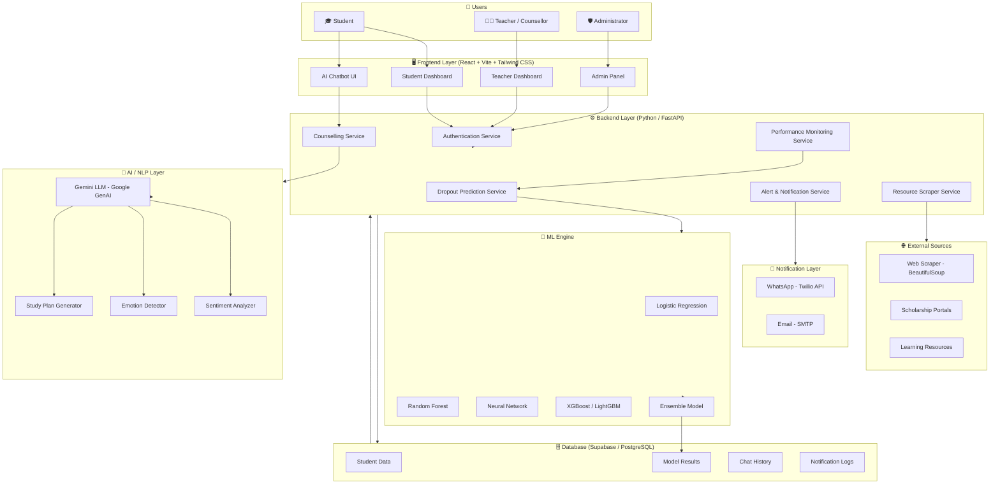

---

## 3. Layered Architecture Breakdown

The system follows a **5-layer architecture**:

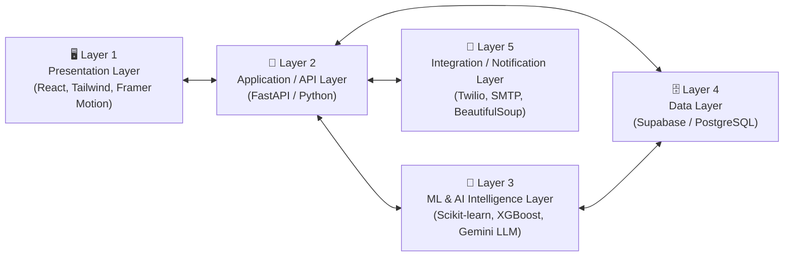

| Layer | Responsibility |
|-------|---------------|
| **Presentation** | UI for students, teachers, admins; chatbot interface |
| **Application/API** | Business logic, routing, REST API endpoints |
| **ML & AI** | Dropout prediction models, sentiment/emotion analysis, generative AI counselling |
| **Data** | Persistent storage of student records, model outputs, chat logs |
| **Integration** | External APIs — WhatsApp, Email, Web Scraping |

---

## 4. Module-wise Architecture

### 4.1 Data Ingestion & Storage Layer

This module handles all incoming student data, cleans it, and stores it for ML training and real-time prediction.

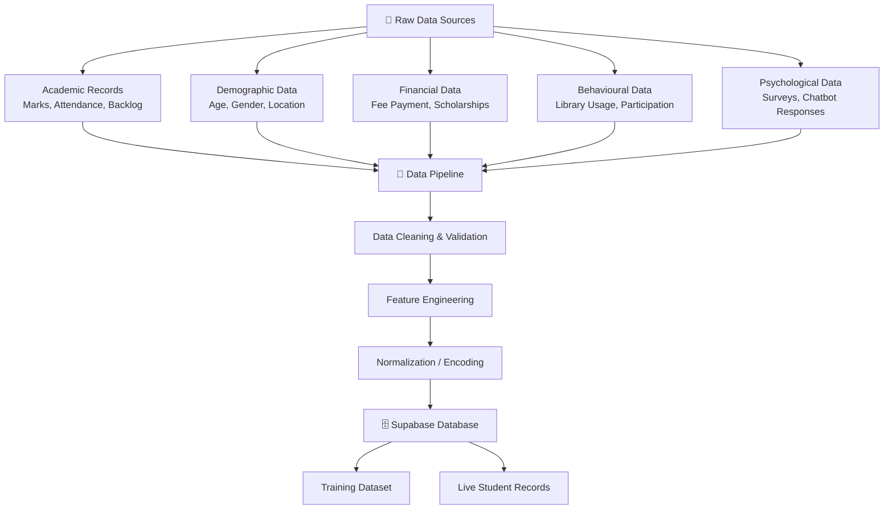

**Key Features:**
- Handles structured (CSV/DB) and unstructured (chatbot transcripts) data
- Feature engineering adds 15+ features beyond what the existing system used
- All data is stored securely in **Supabase (PostgreSQL)**

---

### 4.2 Machine Learning Prediction Engine

The core prediction engine, trained on enhanced datasets with improved accuracy.

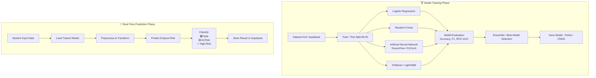

**Model Features Used (30+ features):**

| Category | Features |
|----------|---------|
| Academic | Attendance %, Internal Marks, Backlogs, GPA Trend |
| Behavioural | Library visits, Lab hours, Club participation |
| Socio-Economic | Family income, Fee payment status, Part-time job |
| Psychological | Survey scores, Chatbot sentiment scores |
| Demographic | Age, Gender, Distance from college, First-gen student |

**Target Accuracy:** > 90% (vs. 85% in existing system)

---

### 4.3 AI Counselling Assistant

This is the most novel module — an intelligent chatbot integrated with Gemini LLM.

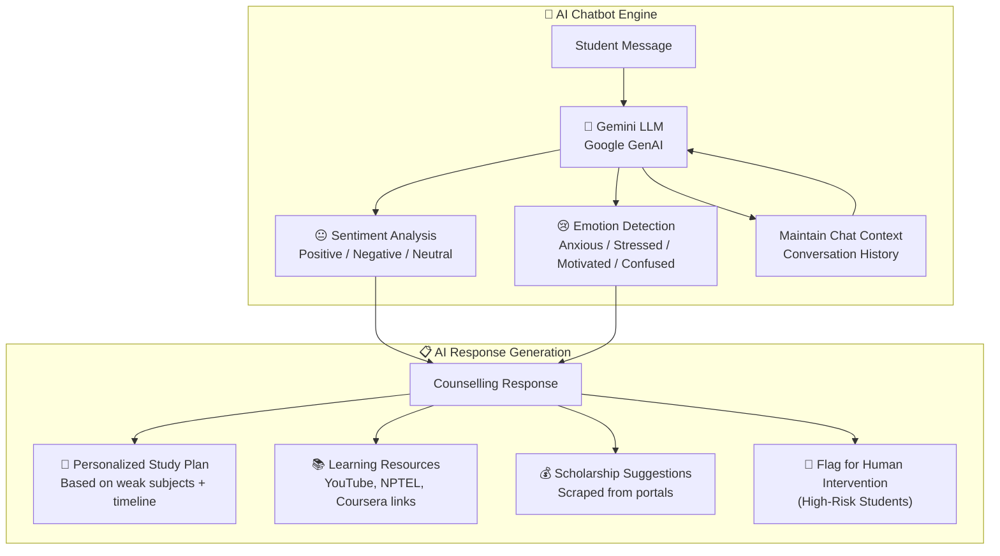

**Counselling Logic:**

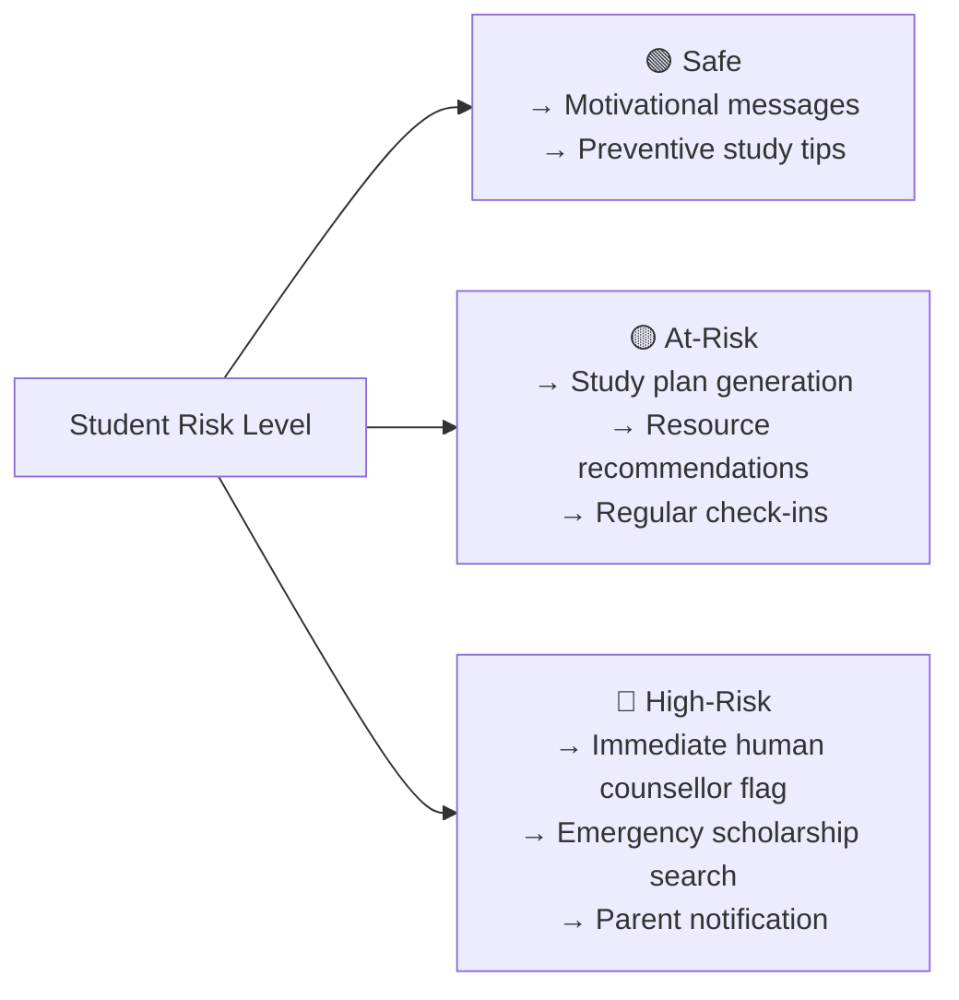

---

### 4.4 Performance Monitoring & Alerts Module

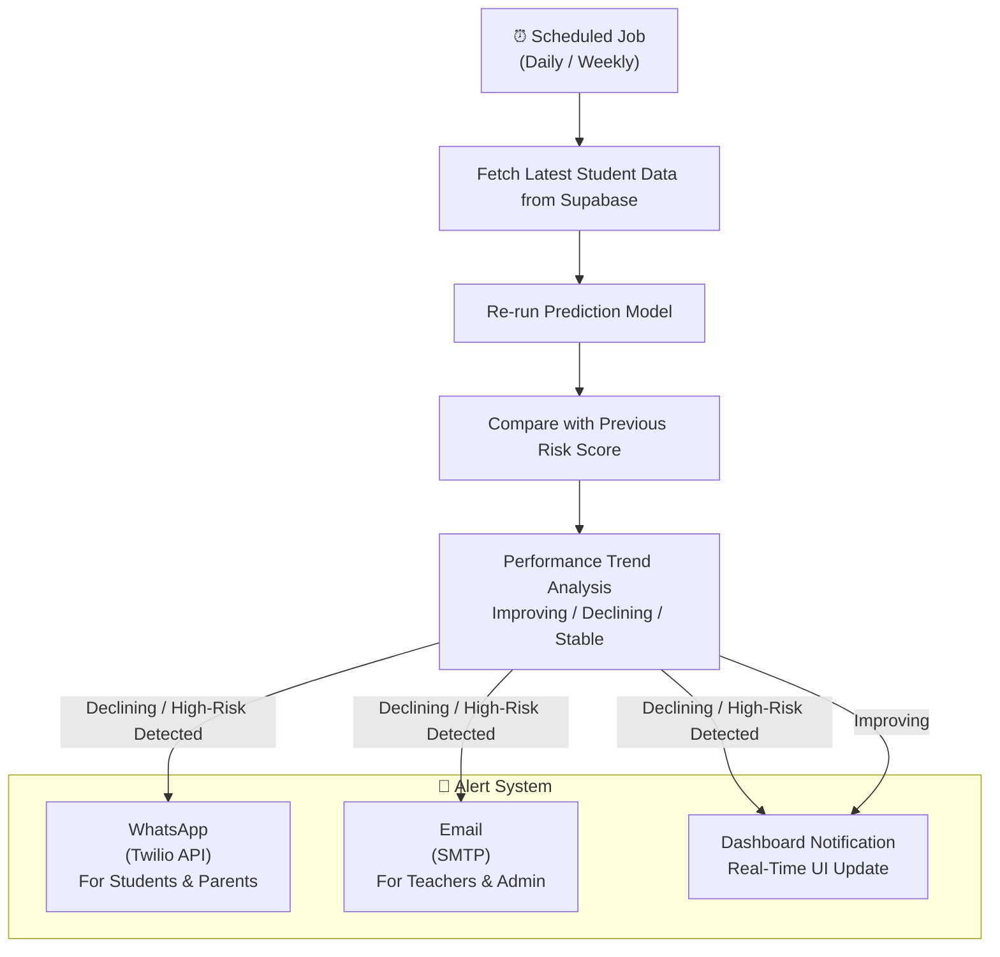

**Alert Triggers:**

| Condition | Alert Target | Channel |
|-----------|-------------|---------|
| At-Risk detected | Student, Parent | WhatsApp + Email |
| High-Risk detected | Teacher, Counsellor | Email + Dashboard |
| Missed reminder | Student | WhatsApp |
| Exam approaching | Student | WhatsApp |
| Fee due | Student, Parent | Email |

---

### 4.5 Frontend Web Application

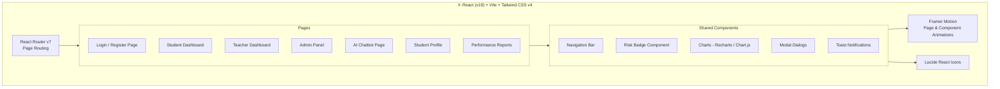

---

## 5. Data Flow Diagram

### Level 0 — Context Diagram

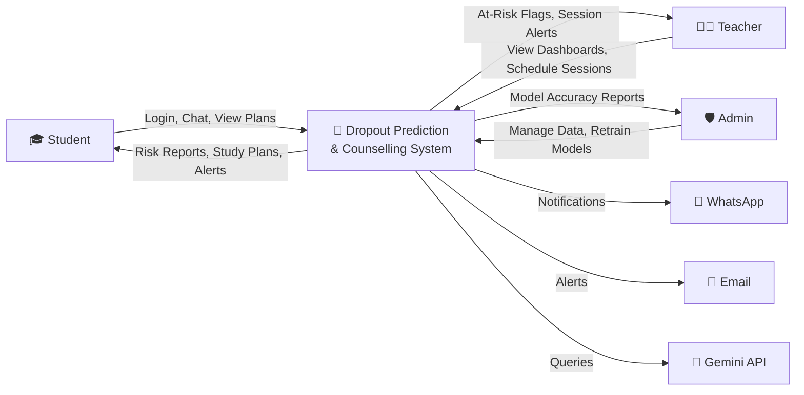

### Level 1 — Functional Data Flow

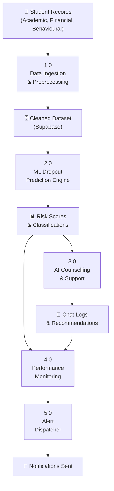

---

## 6. User Interaction Flows

### Student Flow

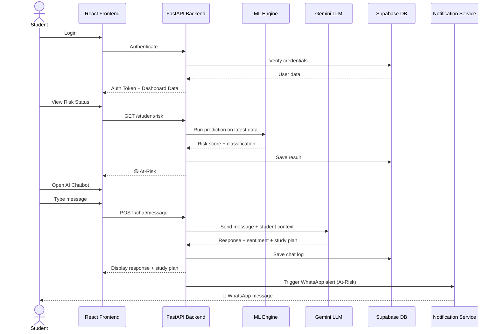

### Teacher Flow

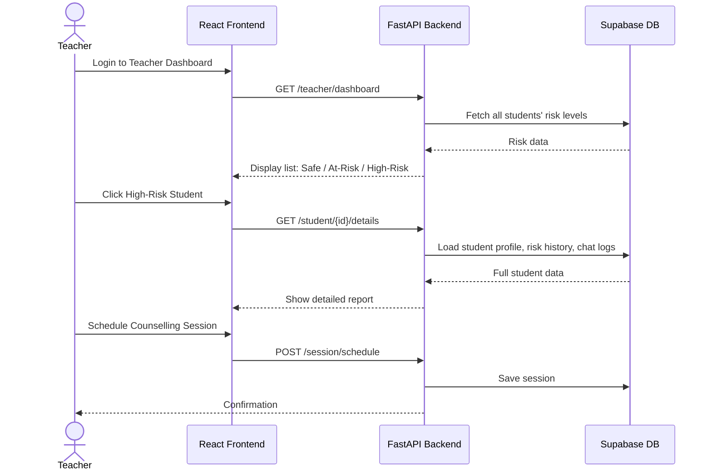

---

## 7. Database Schema Overview

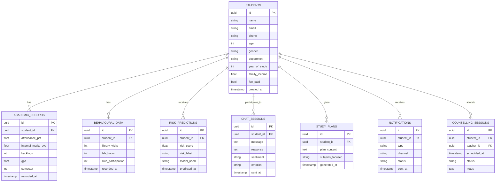

---

## 8. Technology Stack Mapping

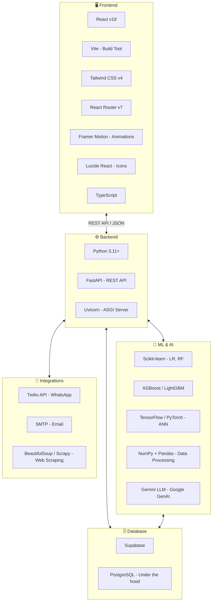

| Layer | Technology | Purpose |
|-------|-----------|---------|
| Frontend | React v19 + Vite | UI framework + build tool |
| Styling | Tailwind CSS v4 | Utility-first CSS |
| Routing | React Router v7 | Client-side navigation |
| Animation | Framer Motion | Page/component animations |
| Icons | Lucide React | Icon library |
| Language | TypeScript | Type-safe JavaScript |
| Backend | FastAPI (Python) | REST API server |
| ML | Scikit-learn, XGBoost, TensorFlow | Dropout prediction models |
| NLP/AI | Gemini LLM | Chatbot & sentiment analysis |
| Data | NumPy, Pandas | Data preprocessing |
| Database | Supabase (PostgreSQL) | Data persistence |
| WhatsApp | Twilio API | Real-time messaging |
| Email | SMTP | Automated email alerts |
| Scraping | BeautifulSoup | Scholarship/resource discovery |

---

## 9. Deployment Architecture

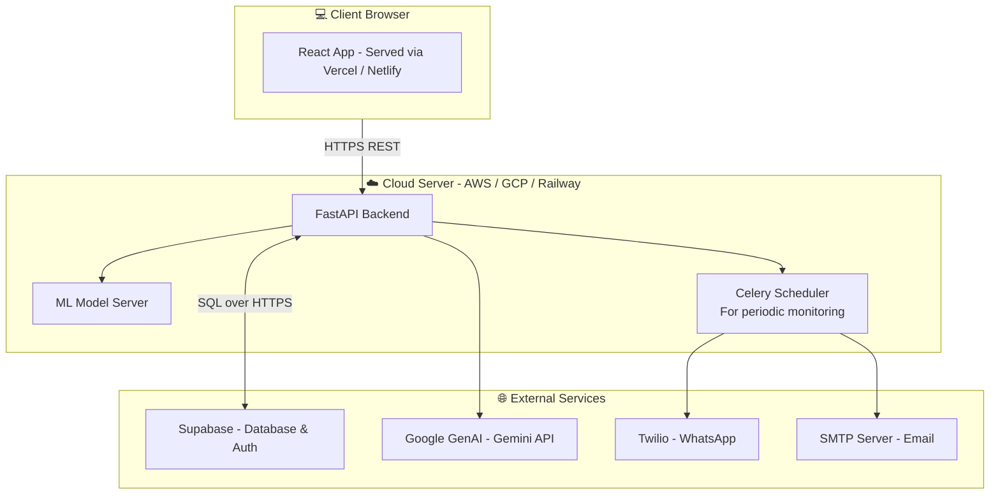

---

## 10. Security Considerations

| Concern | Approach |
|---------|---------|
| Authentication | Supabase Auth (JWT tokens) |
| Authorization | Role-based access (Student / Teacher / Admin) |
| Data Privacy | Encrypted student data at rest in Supabase |
| API Security | API key management for Gemini, Twilio, SMTP |
| HTTPS | All client-server communication over HTTPS |
| Input Validation | FastAPI Pydantic models for request validation |
| Secrets Management | Environment variables (.env), never hardcoded |

---

## Summary: System Architecture at a Glance

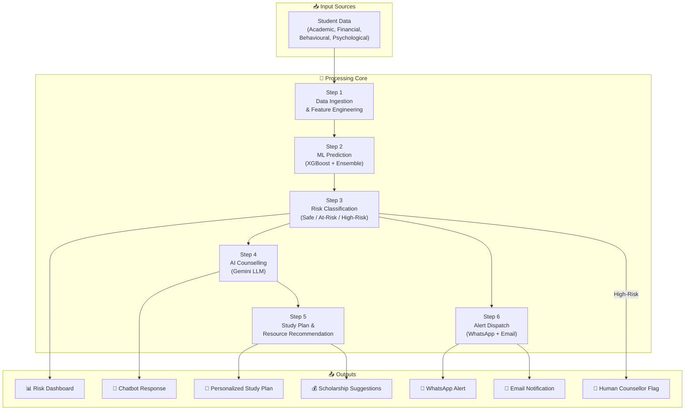

---

> [!IMPORTANT]
> **For Mini Project Scope:** You don't need to implement ALL modules fully. Prioritize: (1) ML Prediction Engine, (2) AI Chatbot via Gemini API, (3) React Dashboard, (4) Supabase Database. Email/WhatsApp and web scraping can be demonstrated as simulated features if needed.

> [!TIP]
> **Suggested Development Order:**
> 1. Set up Supabase database and schema
> 2. Build and train ML models (Python notebooks first)
> 3. Create FastAPI backend with prediction endpoints
> 4. Integrate Gemini LLM for chatbot
> 5. Build React frontend (Dashboard + Chatbot UI)
> 6. Add WhatsApp/Email alerts last

> [!NOTE]
> This architecture is designed to be **modular** — each component (ML engine, chatbot, alerts) can be developed and tested independently before integration, which is ideal for a team-based mini project.
